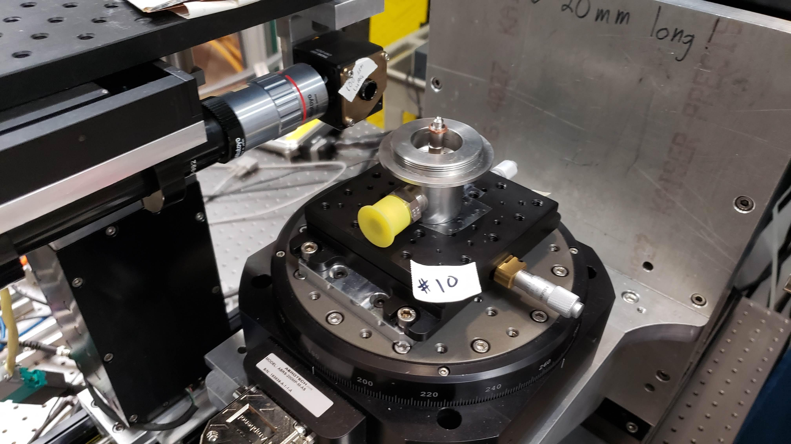

=========
7-BM Docs
=========

Manual and troubleshooting information to operate the APS beamline 7-BM.

Content
-------

.. toctree::
   :maxdepth: 1

   source/about
   source/user_info
   source/general_controls
   source/operations
   source/flow_infrastructure
   source/tomography
   source/high_speed_imaging
   source/edd
   source/radiography
   source/fluorescence
   source/optics
   source/links
   source/staff
   source/support
   source/troubleshoot

Contribute
----------

* `Documentation <https://github.com/xray-imaging/7bm-docs/tree/master/docs>`_
* `Issue Tracker <https://github.com/xray-imaging/7bm-docs/issues>`_

Mailing list
------------

To subscribe to the 7-BM mailing list please go to the `list info <https://lists.anl.gov/mailman/listinfo/2-bm>`_ page. Once subscribed you can email the list at: 7-bm@anl.gov.

Mailing list administrators can configure the mailing list `here <https://lists.anl.gov/mailman/admin/7-bm>`_.
