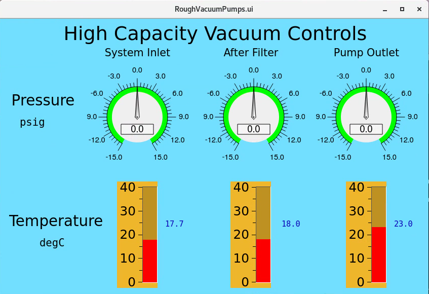

============================
Compressed Air System
============================

7-BM-B is equipped with a high volume compressed air system for flow and combustion experiments.

Operation
---------

Beamline staff will start the compressed air system.  User controls are found under "Extra Screens" on the 7-BM-B control screen.

.. image:: img/compressed_air_control_screen.png
   :width: 640px
   :align: center
   :alt: Compressed air control screen

The screen is fairly self-explanatory.  Enter the desired setpoint pressure in psig.  When the user clicks "Start Flow!" the MW100 will send an analog voltage to the electronic regulator controlling the air flow, starting the air flow at the desired set pressure.  Clicking "Stop Flow!" will set the delivery pressure to zero.

Setup Notes
-----------

The electronic regulator needs a pressure reading downstream of the regulator to control the flow.  This is by default set up as a 0-200 psig transducer located on the side of the regulator body.  This is a workable system but may not accurately represent the downstream pressure at high flowrates.  If another 4-20 mA output transducer is used as feedback, more accurate control can be expected.

In order to view the delivery pressure in the control screen, a transducer must be included to view the pressure.  This can be ported to the MW100 AI channel #3 for readout.  It expects 1-5 V = 0-200 psig.

Components
----------

Kaeser BS61 compressor, rated for 240 scfm and 110 psig maximum pressure.  The effective working pressure is more nearly 100 psig.

Kaeser KAD260 dessicant dryer

400 gallon air accumulator tank

1060 gallon air accumulator tank

High-flow air regulator

Tescom ER5000 electronic regulator

==================================
Vacuum System
==================================

7-BM-B is also equipped with a high-volume vacuum system consisting of two identical rotary claw vacuum pumps.  The system is nominally capable of accepting 200 scfm at 0.5 atm absolute pressure.

Operation
----------

Controls to turn the pumps on and off are found on the HMI screen located in the user station control rack.

To see a readout of the vacuum pressures and temperatures, go to Extra Screens in the 7-BM-B control screen

