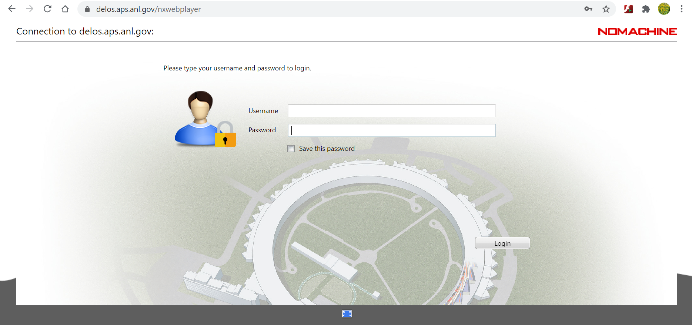
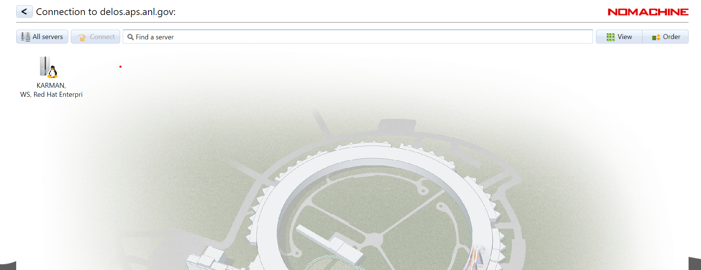
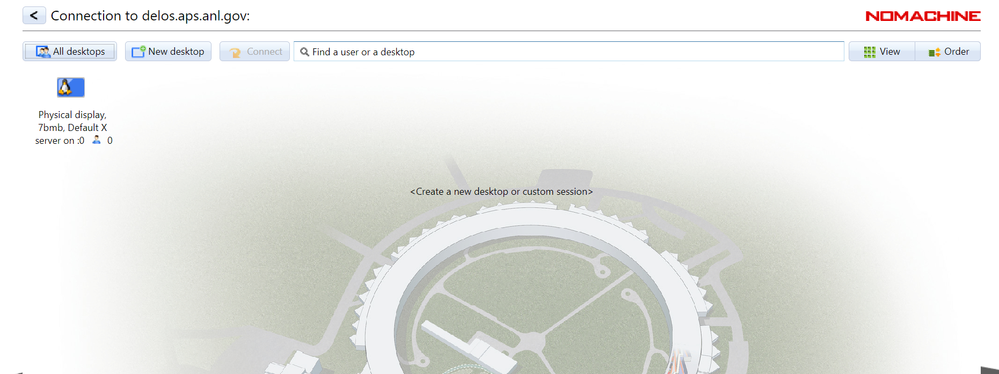

Remote access
=============

Remote access to beamline control computers is granted to users having a valid badge number and an active/scheduled proposal. 
To connect to 7-BM control computer, please go to https://delos.aps.anl.gov and login using your Argonne credentials.
Select "karman, WS, Red Hat Enterprise Linux Workstation".  On the next screen, select the physical desktop.  Once connected, you will have the same control over the experiment you would have if seated at the beamline.

For enable users for remote access see

- https://wiki-ext.aps.anl.gov/remoteaccess/index.php/Main_Page
- https://forge.xray.aps.anl.gov
- https://delos.aps.anl.gov
