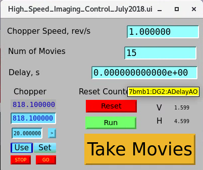

High-Speed Imaging
==================

High-speed imaging at 7-BM is done with the white x-ray beam, with optional filters to reduce x-ray exposure.  An important consideration in these experiments is that the heat load from the white beam can quickly cause both radiation and thermal damage to both samples and the scintillator crystal used for x-ray imaging.  

Controls
--------

In order to ensure correct sequencing of the acquisition, a user string sequence is used, which is controlled using a control screen shown below; a link to it can be found in the 7-BM-B screen under "Imaging and Tomo."  Set the number of movie sequences to take and the rotation rate of the chopper (pulses come at twice this rate).  Then, to take images, arm the high-speed camera and click "Take Movies."  The total number of triggers will be greater than the number of movies requested to account for variations in shutter timing and chopper spin rate.

Cameras
-------

High-speed imaging is typically performed with a Photron Nova S16 camera.  The camera is connected to the Windows workstation at the user station with dedicated RJ-45 patches rated to 10 Gb.  Users wishing to use their own cameras are free to bring them.  Our normal mode for imaging is to take multiple short high-speed movie sequences, one for each chopper opening (see below).

Optical setup
--------------

A typical high-speed imaging setup is shown below.  The scintillator is mounted to a 30 mm Thorlabs turning mirror cube, which is in turn mounted on an optical rail carriage.  The imaging cube is mounted to an adjustment motor that moves the cube along the rail to allow the camera to be focused.  The camera is fixed to the optical rail; the exact mounting scheme depends on the camera.  The optical system shown here is one that works well for high-speed imaging.  I uses two camera lenses (Nikon 105 mm f/2.8 near the camera, Nikon 50 mm f/1.2 near the imaging cube) coupled on their filter rings.  It gives a roughly 2x magnification with a high degree of light capture.

.. image:: img/high_speed_Imaging_eg.png
   :width: 640px
   :align: center
   :alt: Typical high-speed imaging optical setup

Rotary Chopper
--------------

The beamline is equipped with a rotary chopper to reduce x-ray exposure onto samples and detectors.  This is particularly relevant for studies with white beam, since prolonged white beam exposure on the scintillator crystals used for imaging can cause thermal cracking.  In general filtering must be used when using white beam unless the chopper is being used to reduce the beam duty cycle.  See the :ref:`filter documentation <Filter_target>`: for further information on operating the filters.  For alignment purposes where a continuous beam is needed, 1 mm Cu filtering is usually safe to use.  Keep in mind that the propensity for the beam to cause thermal cracking is a function of the scintillator type, scintillator thickness, beam filter, beam size, and chopper operation.  As such, in general, limit the beam size, exposure time, and overall flux to the extent feasible. 

The chopper consists of two notched copper disks bolted to each other and driven by a stepper motor.  Motor 27 is preconfigured to run the chopper.  Each disk has two notches, so x-rays are transmitted twice for every rotation of the chopper wheel.  The two disks can be manually rotated with respect to each other to change the duty cycle of the chopper by removing the aluminum cover over the disk, making sure to disconnect the motor first.

.. image:: img/chopper.png
   :width: 320px
   :align: center
   :alt: Image of chopper

.. image:: img/chopper_short.png
   :width: 320px
   :align: center
   :alt: Image of chopper

.. image:: img/chopper_long.png
   :width: 320px
   :align: center
   :alt: Image of chopper

**NOTE**: keep in mind that the chopper can only reduce x-ray exposure on components if it is either moving or if it is stopped at a point where the x-rays are being blocked.  A good way to ensure this is to index the chopper motor to start chopper motion at an orientation where the beam is blocked and move in integer rotations of the chopper. 

Triggering and Timing
---------------------

For timing, the chopper is equipped with a photoeye.  This photoeye is supplied with 12 VDC and outputs a signal which is 1 V when the chopper wheel blocks the photoeye, 2 V when the photoeye probes the opening, with 50 ohm termination.  The photoeye will be triggered approximately 1/6 of a rotation before the x-rays are allowed through.  The chopper signal is sent to DG645 #2.  This timing generator delays until the chopper opening reaches the x-ray beam, then triggers the camera on channel AB.  This delay is different for every chopper duty cycle and spin speed.  To find this delay, set the camera to single trigger mode at a reasonable framerate (10 kHz can work well), set it to record for a large number of frames, arm it, then press the "Take Movies" button in the High-Speed Imaging control window.  Find the frame where the x-ray beam appears and the duration of the time for which the x-ray beam appears.  Use these values to set the proper delay time and the number of frames to save in each movie sequence.

If one wishes to synchronize to the ring, one must supply the camera with a Sync In signal.  Take the P0 signal from either the Machine Status Link or the MRD100 board, use this to trigger DG645 #1, set a 1 microsecond long pulse on channel AB of DG645 #1, then use this for the camera sync signal.  This will sync the camera at 271 kHz.  If a slower repetition rate is desired, use the Prescale feature under Advanced Triggering on the DG645.

.. contents:: 
   :local:

