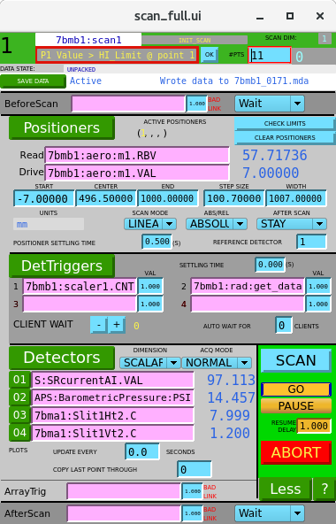

Step Scans
================

.. contents:: 
   :local:

Step scans are controlled through the EPICS scan record.  The scan record is designed to move an EPICS PV (usually a motor) to a series of predetermined points, collecting data at each point.  The control screen can be accessed through 7-BM-B control screen under "Scan Control".

The basics of the scan record can be seen in its layout.  To set up the scan record:

* Enter in any actions that should be done before the scan starts.  These can be actions on single PVs or can call a string sequence for more complex tasks.

* Enter the PV that will be scanned, termed the Positioner.  This is usually a motor.  Entries should be made to the Read and Drive fields.  For a dummy scan (with no scanning) typically the Drive field is left blank and *time* is entered into the Read field.

* Set the points to be scanned.  The data fields provided in the scan record (start, end, center, spacing, range, number of points) are of course not all independent.  The scan record automatically updates these as values are changed to make a consistent set of parameters.  Typically, one changes the start, end, and either spacing or number of points.

* Check the other positioner parameters.  Most users want a step scan.  Table scans can be used to give the scan record a non-uniform grid of points, but requires more complex setup.  Relative scans can be useful for alignment, but the points measured can be deceiving when the motor is far away from zero.  The after-scan action has several options, though Stay and Prior Position are the two most commonly used.

* Set the PVs that will be set at each point.  There must be at least one PV that is set to a value at each point.  When the PV is set back to zero, this is the indication to the scan record that the point is finished.  These PVs are usually PVs to trigger detectors.  It should be noted that EPICS PV calls have a fair degree of latency.  As such, it is often helpful to have at least one detector take at least a few tenths of a second to complete, otherwise the scan record can sometimes read a trigger PV before it has been set, fooling the scan record into thinking the trigger PV is signaling that it is done.  Counting on a scaler board works well for this.

* Set the detectors.  Just about any numerical EPICS PV can be entered as a detector.  For array PVs (mainly fluorescence detector MCA outputs and multichannel scalar outputs), the detector type should be set to Array; for other variables, Scalar is appropriate.

Scan records can be daisy-chained to perform multidimensional scans.  To do this, simply put the PV corresponding to the *Scan* button on the scan record for the lower dimension as a trigger of a higher-dimension scan.
