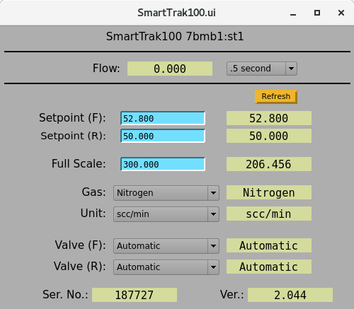

Flow Controllers
=======

7-BM is equipped with three Sierra Smart-Trak gas flow controllers.  These controllers can be controlled via EPICS, which makes them ideal for providing and monitoring gas flows for experiments.  They are capable of handling a wide range of gases and displaying a wide range of units.  The controllers are also all rated for 500 psig inlet pressure.

============================    ================================
Maximum flowrate                Calibrated Gas                  
============================    ================================
300 SCCM                        Kr
5 LPM                           N\ :sub:`2`
20 LPM                          N\ :sub:`2`
============================    ================================    

Connecting the controllers
------------------------------
Two of these controllers can be controlled at any time, which are labeled ST1 and ST2 in the control software.  Any of the controllers can be used with either of these prefixes.  To use the controllers.

#. Provide the controllers with power (24 VDC) via the BNC pigtail.  The controller display should say "Waiting for meter"
#. Connect gas to the controller inlet.  Since the state of the controller is undetermined when first powered on, use caution in supplying gas pressure to the controller until it is fully operational.
#. Connect the serial connection on the pigtail to the DB-9 breakout in the control rack above the VME crate.  Use the patch panels.  You must use the DB-9 port corresponding to the controller prefix you wish to use.  Use the patch panels to connect from inside 7-BM-B to the control rack.
#. Edit the VME crate boot script to enable the controller(s) you wish to use.  This must be done by beamline staff.
#. Reboot the VME crate.

Using the controllers
-----------------------

The flow controllers are easily controlled in EPICS.  The screens for the two flow controller channels can be found at the bottom right corner of the main 7-BM-B control screen (7bmb1.ui).  The flow controller screen displays both RAM (R) and flash (F) values for the pertinent parameters.  Often changing only the flash value is sufficient for the controller to respond.  If the controller appears to be unresponsive, try changing both the (F) and (R) values.

.. image:: ../img/7bmb1.png 
   :width: 320px
   :align: center
   :alt: 7bmb control screen

