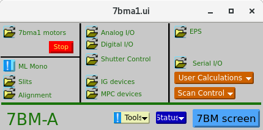
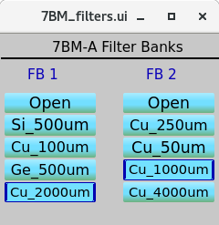
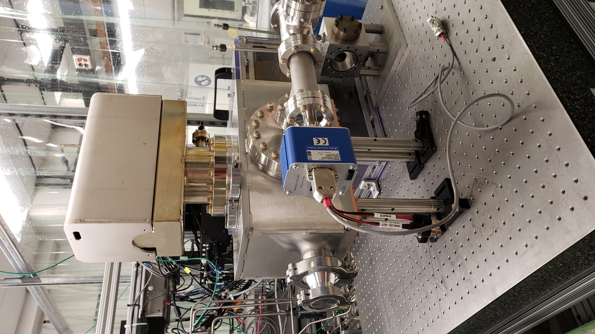
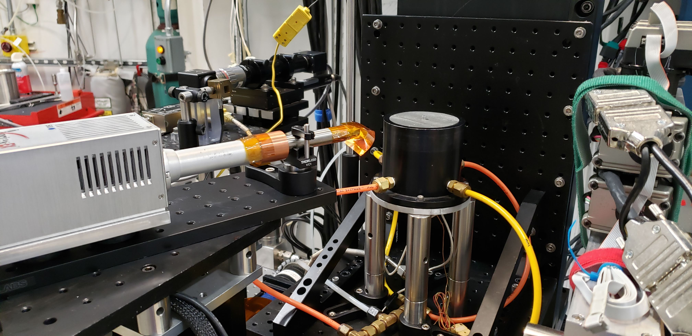
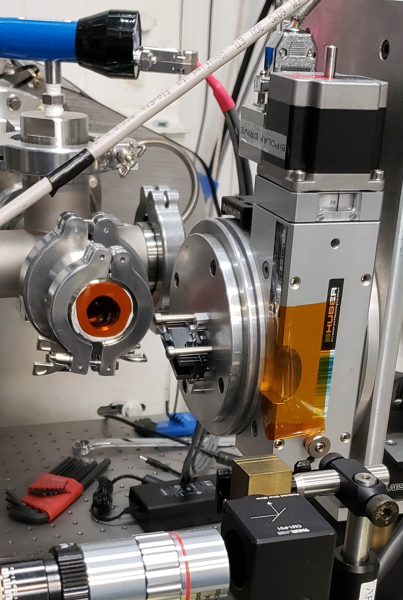

=============
X-ray Optics
=============

7-BM features a series of x-ray optics to manipulate the x-ray beam.

Filters
--------

A water-cooled filter set is located in 7-BM-A.  This is mostly used to prefilter the beam for tomography and high-speed imaging experiments, though it can also be used to filter low energy x-rays when using the single-bounce multilayer mirror (described below).  The control for the filters is found in the 7-BM-A control screen under Alignment.  There are two filter units, so up to two filters can be used simultaneously.

It takes several seconds to move between filter materials.  Please remember to close the 7-BM-A shutter before moving the filters.

Double Multilayer Monochromator
---------------------------------

For monochromatic beam experiments at 6-16 keV, a double multilayer monochromator is used.  The monochromator has two polished Si substrates, each 60 mm wide x 120 mm long.  The substrates were coated with three stripes by Rigaku.  One stripe is at 2.0 nm nominal d-spacing.  The second is at 3.5 nm nominal d-spacing.  The middle stripe is split: the bottom half of the beam is reflected from a 2.0 nm coating, the top half from a 3.5 nm coating.  This is useful for dual-energy experiments.  Each stripe is ~ 8 mm wide.

7-BM-B Multilayer Mirror
-------------------------------

For more flexibiity in energy range, a multilayer mirror can be placed in 7-BM-B.  This mirror has two coatings, at 2.1 nm and 4.0 nm nominal d-spacing, respectively.  The mirror uses a 200 mm long Si substrate.  This mirror is operated with the beamline in white beam mode, and requires cooling water from the hutch DI water system.

Focusing Mirrors
----------------

For focused-beam experiments with the monochromatic beam, the beamline has a pair of IDT Kirkpatrick-Baez focusing mirrors.  The mirrors are silicon, each 300 mm long, with a 260 mm optical length.  The mirrors can be dynamically bent to change the focal position.  Typical operation of the mirrors is a 5 mrad grazing angle at 8 keV, 3-3.5 mrad at 15 keV.  The mirrors are Rh coated.  To use these mirrors, remember that a helium purge must be established first.

Polycapillary Optics
--------------------

The beamline is equipped with two polycapillary optics from XOS.  The first optic has a 100 mm focal length and is optimized for lower photon energies.  The second is 50 mm focal length and works well at I :math:`K_{\alpha}` (28.6 keV).  Both optics are uncoated glass.  These optics are mostly used for confocal fluorescence microscopy.

Channel Cut Si Crystals
-----------------------

The beamline has three silicon channel cut crystals, all made by the APS Optics group.  While these crystals can be used to create a more monochromatic beam (~ 1 eV bandpass) for experiments, they are more typically used for energy calibrations.  The three crystals are one Si(220), 20 mm long, one Si(220) 40 mm long, and one Si(111), 40 mm long.  All have an 8 mm spacing between the diffracting planes.  There are also base plates to mount these crystals to a Huber 410 rotation stage.

Equations, for crystal angle :math:`\theta` and distance between the two diffracting planes of h:

.. math::    
    \text{vertical beam offset} = \frac{2h}{\cos{\theta}} 

    \text{length on crystal} = \frac{h}{\tan{\theta}} 

    \frac{12.398}{E(kev)} = 2 d \sin{\theta}
 
    d = 3.84 \r{A} \text{for Si(220)}, 6.27 \r{A} \text{for Si(111)}    

.. contents:: Contents:
   :local:

