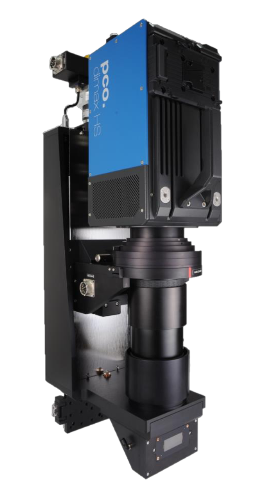

Visible Lens 
============

Imaging and tomography 
----------------------

.. _White Beam single Obj: https://anl.box.com/s/vkz5oifvf2vi08pmcippikcwx1zhjzhr
.. _WB Test 1: https://anl.box.com/s/djl0v91jjeuxz9oa72n2okipiagjnw3e
.. _WB Test 2: https://anl.box.com/s/mrndbwfwqdgj31idfazakgd8stl0w86t
.. _WB Man: https://anl.box.com/s/c5pbdkikbgh7j42n8p8hljstai2unc8v
.. _WB Inv: https://anl.box.com/s/c4fygn003c8wi1y2gz43o7es0x717ghh
.. _WB Ord: https://apps.inside.anl.gov/paris/req.jsp?reqNbr=G0-261051

.. _Microscope Tandem: https://anl.box.com/s/zhl28qzojmzje1gkime9g2maz4rxhvlm
.. _MT Man: https://anl.box.com/s/f43or1ruvyeu2j8b1kkry3gir3o8vvey
.. _MT Test : https://anl.box.com/s/ysvn43i89s6wbv99oyta39oiu3hz2l2d
.. _MT Inv: https://anl.box.com/s/lo2itrtpaovyjm5yw2vchz0uz7hhfqyf
.. _MT Ord: https://apps.inside.anl.gov/paris/req.jsp?reqNbr=G3-181073

These are the `Optique Peter <http://www.optiquepeter.com/>`_ systems for visible light detection avaialble at 7-BM:

+------------------------+-------------------+-----------------+---------------------------+------------------+-----------+
| **Name**               |      **Image**    |  **Manual**     |     Tests                 |         Invoice  |   Order   |
+------------------------+-------------------+-----------------+---------------------------+------------------+-----------+
|`White Beam single Obj`_|     |op0001|      |  `WB Man`_      | `WB Test 1`_, `WB Test 2`_|      `WB Inv`_   | `WB Ord`_ |
+------------------------+-------------------+-----------------+---------------------------+------------------+-----------+
|`Microscope Tandem`_    |     |op0002|      |  `MT Man`_      | `MT Test`_                |      `MT Inv`_   | `MT Ord`_ | 
+------------------------+-------------------+-----------------+---------------------------+------------------+-----------+

.. |op0001| image:: ../img/optique_peter_single.png 
   :width: 50px
   :alt: op_01

