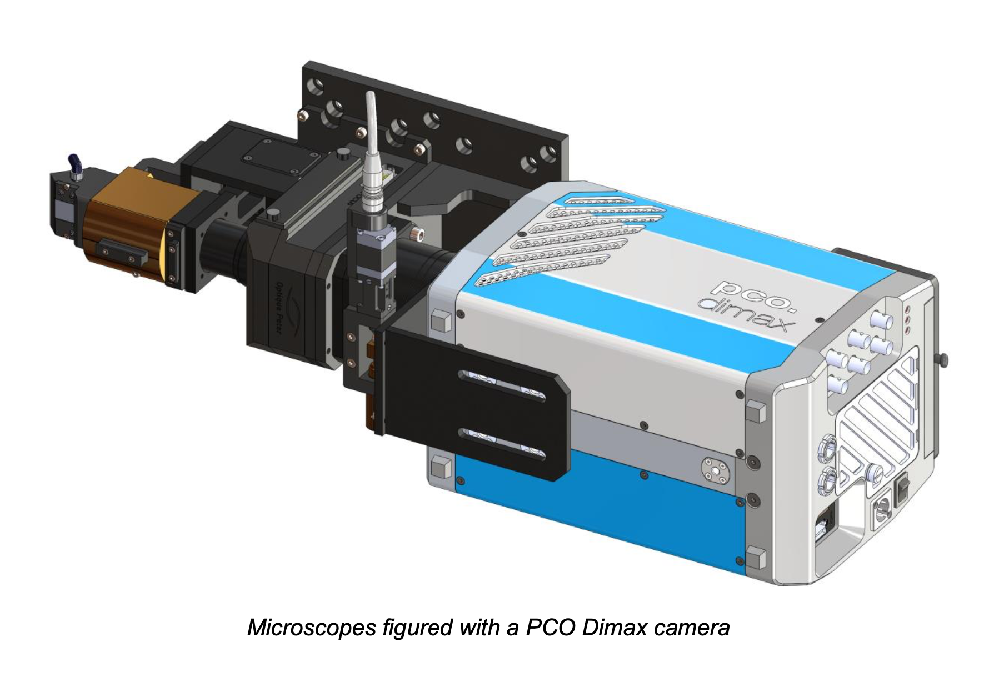

Visible Lens 
============

Imaging and tomography 
----------------------

We installed an `Optique Peter <http://www.optiquepeter.com/>`_ system for `visible light detection <https://anl.box.com/s/mib4c51emgr6dj8hs2e2qu3g1ozearsg>`_ 
at `synchrotron facility <https://anl.box.com/s/y7dvpe53laghdmjwnmm63ztfks6l4ltd>`_.

`Reference documentation <https://anl.box.com/s/ppb53bvkusbzvnx3j5ezgjsic4yetz81>`_

Single Objective
~~~~~~~~~~~~~~~~

1. `Manual <https://anl.box.com/s/djl0v91jjeuxz9oa72n2okipiagjnw3e>`_
2. `Test Part 1 <https://anl.box.com/s/mrndbwfwqdgj31idfazakgd8stl0w86t>`_
3. `Test Part 2 <https://anl.box.com/s/c5pbdkikbgh7j42n8p8hljstai2unc8v>`_
4. `Ref single <https://anl.box.com/s/1dvyji993rioc46vl2p5bmvq62w3d8py>`_
5. `Part list <https://anl.box.com/s/7jsbs1u2jctc5u8ozyxl48jf17wx6avy>`_
